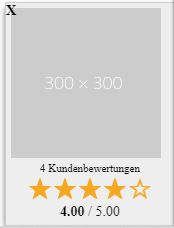
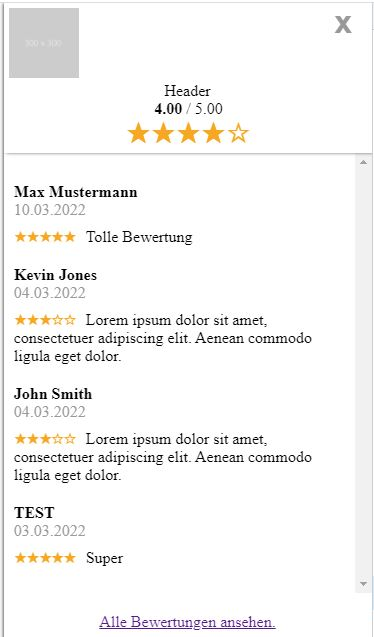
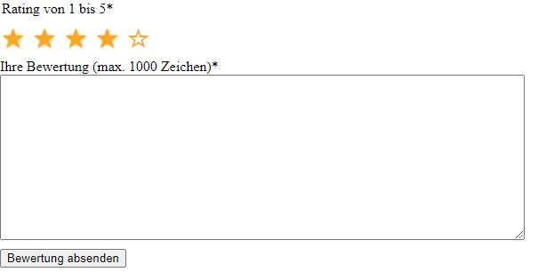

# Contao4you reviews Bundle

Dieses Contao-Bundle dient zur (automatisierten) Erfassung und Ausgabe von Kundenbewertungen.

## Features

* Kategorien/Bewertungen
* Name, Bewertung, Sterne
* Badge mit Logo, Anzahl der Bewertungen und der durchschnittlichen Bewertung, z.B. 4,5/5 sowie Darstellung mit Sternen
* Liste mit allen Bewertungen
* Ein Service, mit dem automatisiert Einladungen mittels Notification_Center zu einer Bewertung
  verschickt werden können (z.B. nach einem Kauf im Shop)
* Ausgabe eines RichSnippets

### Badge

Die Bewertungen werden mit einem Badge dargestellt. Das Badge wird typischerweise
auf der Seite an einer fixen Stelle angezeigt mit einem Logo, der
durchschnittlichen Sterne-Bewertung und der Anzahl der Kundenbewertungen.
Mit Klick auf das Badge wird eine Liste mit x Bewertungen (einstellbar)
angezeigt sowie einem Link zur Seite mit allen Bewertungen.

Das Badge kann weggeklickt werden. Das wird als Session-Cookie gespeichert.
Sobald der Browser geschlossen und neu geöffnet wird, erscheint das
Badge erneut.





## Formular



## Einladung

Um eine Bewertung abgeben zu können, muss der "Kunde" eingeladen werden.
Hierbei wird ein Token generiert, womit der Kunde eine einmalige Bewertung
abgeben kann. Die Einladung kann mit dem Formular verschickt werden
oder automatisiert per ReviewsService->sendLink(...) oder per API (siehe weiter unten)


## Kategorien

Die Bewertungen werden je Kategorie erfasst. In einer Multi-Domain
Installation können dies z.B. verschiedene Webseiten sein - so dass
für jede Webseite (Seitenbaum) verschiedene Bewertungen erfasst werden
können.

Die Bewertungen müssen nach erfolgreicher Abgabe erst vom Admin aktiviert
werden und können hier auch (im Backend) kommentiert werden.

## Installieren

1. Im Contao-Manager nach c4y/reviews suchen und installieren:
2. oder auf der Konsole composer require c4y/reviews

## Einrichtung

1. Im Notification Center einen Gateway einrichten (falls noch nicht vorhanden)
2. Im Notification Center zwei Benachrichtungungen anlegen. Einmal vom Typ "Bewertungslink". Diese E-Mail wird an den Besucher/Kunden
   verschickt. Als Empfänger kann ##recipient_email## eingetragen werden. Für den Link zum Bewertungsformular dient
   das Simpletoken ##link##. Die zweite Benachrichtung ist vom Typ "Bewertung-Admin-Mail". Diese Benachrichtigung wird verschickt, wenn
   eine Bewertung erfolgreich abgegeben (aber noch nicht veröffentlicht) wurde. Die Benachrichtung kann direkt mit dem Link ##link##
   freigeschaltet werden. Des weiteren stehen die Token ##user##, ##rating##, ##review## und ##category## zur Verfügung.
3. Die folgenden Seiten werden benötigt
   - Bewertung - Link verschicken (um manuell Einladungen zu verschicken)
   - Bewertung - Formular
   - Bewertung - Liste
   - Bewertung - abgegeben
   - Bewertung - Fehler / ungültiger Token
   - Bewertung - Erfolgreich
4. Eine "Kategorie" unter Inhalte / Bewertungen anlegen
   - die Seite "Bewertung - Formular" auswählen
   - die Benachrichtigungen auswählen
5. Die folgenden Module erstellen
   - Bewertungs-Badge (Weiterleitung zur Seite "Bewertung-Liste",
   Auswahl der Logos, Angabe wieviele Bewertungen in der Liste
   erscheinen, die mit Klick auf das Badge eingeblendet werden)
   - Bewertungs-Formular (Weiterleitung zu den angegebenen Seiten
     bei einem fehlerhaften/abgelaufenen Token bzw. nach
     erfolgreicher Abgabe einer Bewertung)
   - Bewertungs-Link verschicken (Angabe der angelegten Kategorie)
   - Bewertungs-Liste (Auswahl der Kategorie, Angabe wieviele
     Elemente pro Seite angezeigt werden sollen)
6. Einbau der Module auf den zuvor angelegten Seiten
7. Einbau des Badge-Moduls im Seitenlayout (am Besten in den Footer)
8. Aktivierung des CSS im Seitenlayout (bei Bedarf bzw. zum Testen)


## Senden per Service

1. Hinzufügen des ReviewService per DI
2. Senden einer Einladung per ReviewService->sendLink($user, $email, $kategorie)
   - der User ist im Klartext derjenige, der bei der Bewertung angezeigt
     wird

## Senden per API

POST Request als JSON. Der API Token muss bei den Bewertungen in der
jeweiligen Kategorie angelegt werden.

```
POST /api/reviews/sendlink
{
	"user": "API User",
	"email": "test@test.de",
	"category": 1,
	"apiToken": "ac43a85f-167c-41db-aa7b-7edb51d6a55b"
}
```
